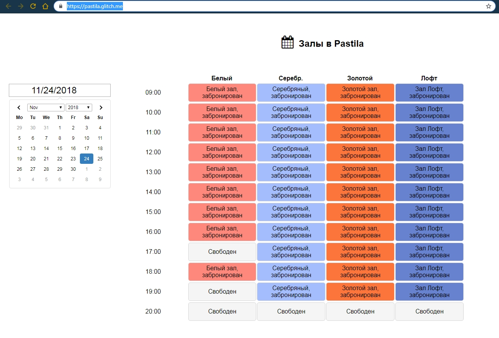
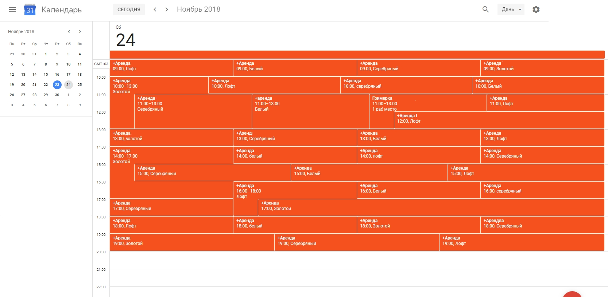

# Pastila-On-Glitch
Available/booked locations view for the local Fotostudio Pastila.

Try it live here: [https://pastila.glitch.me](https://pastila.glitch.me)

This solution makes in-company bookings Google Calendar view available as the user-friendly table to the customers.

Literally it makes this:

from this:

This project also use modified [DateRangePicker](https://github.com/dangrossman/daterangepicker) for embeded calendar control on the page.
Modified JS and CSS of this control are [daterangepicker.css](https://cdn.glitch.com/8c8abf83-748c-401b-8fba-0d082394b640%2Fdaterangepicker.css?1542550681396) and [daterangepicker.js](https://cdn.glitch.com/8c8abf83-748c-401b-8fba-0d082394b640%2Fdaterangepicker.js?1542552213798).
